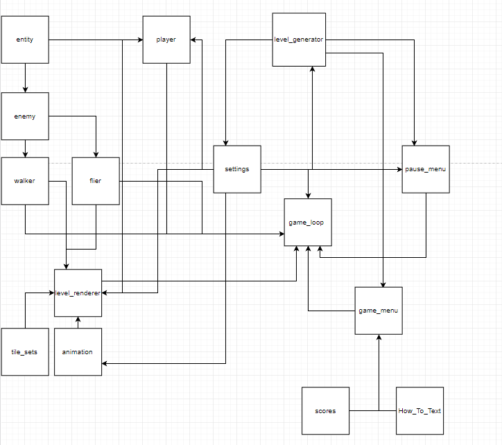
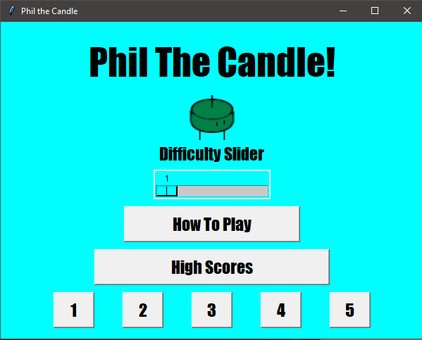
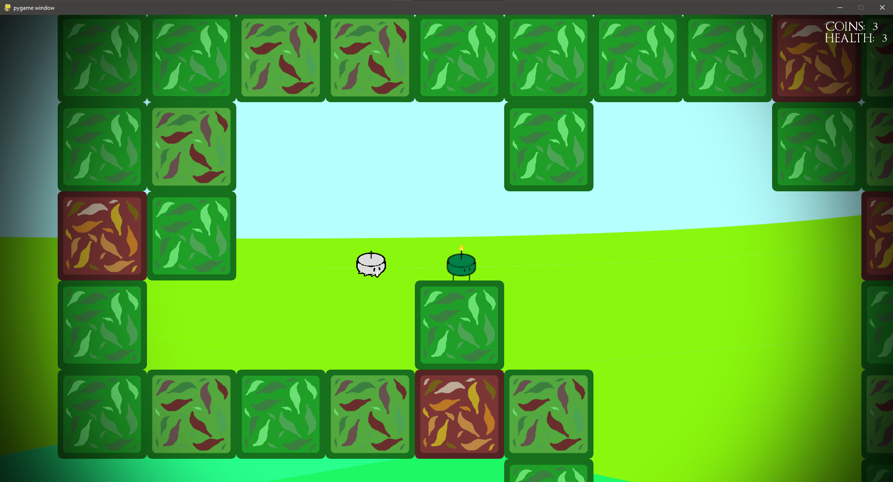
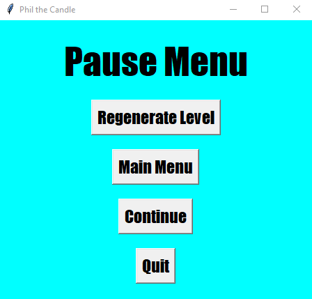

# CPSC-300 Project: Phil The Candle

## Contributors

    Name: Andrew Hunter-Owega
    Email: ahunterow@unbc.ca
    Student Number: 230 147 357
    
    Name: Daniel Strickland
    Email: dstrickla@unbc.ca
    Student Number: 230 146 357
    
    Name: Nicholas Hirt
    Email: nhirt@unbc.ca
    Student Number: 230 127 295

## Notes for Marker

## Relative Table of Contents

    ~ Project Description: Description of the project

    ~ Project Structure: Overview of System Components

    ~ Installation and Execution: How to install and execute the game project

    ~ Game Instructions: How to play and use the game application.

## Project Description

    For CPSC-300, we were given the choice to create a project based around the utilization of software development
    techniques through the creation of a group project. The </name_placeholder> group decided to implement a platforming
    game similar to the Mario series of games developed by Nintendo. The primary features of the game include
    a game window that displays the platforming level, the ability to move and jump, an objective system, an enemy 
    system, a life-death system, a main menu, a pause menu and a score system. For an additional level of complexity
    all levels in Phil the Candle are created through a random generation algorithm. 

## Project Structure

    The Project as described above involves a number of components and files. To simplify the understanding of the code
    a brief overview of the system structure will be given within this section. Note that this description serves as a
    high level description of component function, and some of the primary interactions, and not an extensive review of
    implementation. 

    

    The above diagram shows the primary interactions between system components within the project code, the function of 
    each of these components will be discussed as follows: 

    - tile.py
        An extension of a pyGame sprite, and is used in the creation of animations.py and defines a generic tile in 
        the game. 

    - animation.py
        Implements the most generic functionality for animations of moving objects in the game. 

        - entity.py
            Extension of animation.py such that it allows for the functionality that all moving "entities" will require,
            such as animation support, collision detection, and of course movement. 
            - player.py
                An extension of entity.py that specifies the specific animation, collisions and movements and variables
                associated with the player character in the game. 
            - enemy.py
                An extension of entity.py that specifies the generic animations, collision detection and life status
                shared by enemies regardless of type. 

                - walker.py
                    An extension of enemy that supports gravity for an enemy, and factors such as speed specific to 
                    walking enemies. 

                - flier.py
                    An extension of enemy that lacks gravity support, and factors such as speed specific to flying 
                    enemies.

    - game_menu.py
        Implements the tkinter window used as a welcome screen and primary entry state into the game. It implements the
        functionality to change difficulty, start a level, access highscores and a how to play menu. The score menu
        and how to play menu are implemented within this class as can only be invoked via the main menu. As such the 
        game_menu.py class reads from both the How_To_Play.txt file and scores.json. It is invoked by game_loop.py.

    - pause_menu.py
        Implements the tkiner window accessible only when a pause event is invoked during the execution of a game level.
        (Key press p). It provides the functionality for the user to regenerate a level, quit the game and return to the
        main menu. As such it is connected with level_generator.py, game_loop.py and settings.py. 
        

    The next two classes require a brief description of how levels are randomly generated in the Project. The first step
    in randomly generating a level is accomplished by running a random maze generation algorithm on one of the predefined
    layouts for a level found in level_generator.py. This creates a 2-D List containing a maze. Entities are then randomly
    placed into the maze as either 'E' for enemy, 'F' for flying enemy, or 'O' for objective/coin. This 2-D list is then
    rendered with a tile set. This is done be looking at each entry in the 2-D level array and rendering a five by five
    tile to the game screen based on each level array entry and its surrounding members. There are multiple possible 
    options allowing for more unique game states. 

    - level_generator.py
        The level_generator.py class contains all of the code for generating the 2-D level array as described as above.
        That is to say that it implements a recursive-backtracking algorithm for random maze generation as well as an
        algorithm for the random placement of enemies and objectives into this 2-D level array. Primarily interacts with
        settings, and the game menus. 

    - level_renderer.py
        The level_renderer.py class has two primary functions: (1) determine tile sets, and (2) render level to the 
        screen. The tile set portion of level render picks an appropriate five by five tile to render to the screen
        in place of the one by one entry of the 2-D array. The secondary function of level_renderer.py is to display the
        level and the game to the game screen. Primarily interacts with settings.py, tile_sets.py, animation.py, 
        extensions of entity.py and game_loop.py.
            - tile_sets.py
                tile_sets.py contains all of the possible five by five tile sets that can be used to replace
                entries in the 2-D level array. Seperated into another file due to the verbose nature. 

    - settings.py
        Contains several settings that can be used to alter the project. This includes everything from the size and 
        color of the various game windows, to the penalties used to calculate score. Settings also includes some 
        variables that need to be referenced from multiple components such as curr_difficulty. As such the variables in
        settings.py are used and altered by numerous other components such as pause_menu.py, level_generator.py, 
        level_renderer.py, etc. 

    - game_loop.py
        The game_loop.py component is the heart of the game. It provides the main of the program, and by extension
        the driver code that instructs the other components of the project. As such it has interactions with most of the
        critical components of the game. This means that the level_render.py, settings.py, game_menu.py, pause_menu.py,
        and all extentions of entity.py directly or indirectly plug into game_loop.py. game_loop.py runs the central
        logic loop which organizes the interactions of the other classes as well as driving the central logic of the
        final game. 

    - How_To_Text.txt
        Contains the text that will be displayed on the How_To_Play Menu accessible from the Game's main menu.

    - scores.json
        Json storage of users highest recorded scores. Accessed and rendered by main_menu.py's score menu.  

## Installation and Execution
 
Phil the Game can be accessed from the Git repository found at: 

    https://github.com/NHirt32/CPSC300Project

To get the game code, the project can either be cloned, or be downloaded in a zip folder. There are two primary methods
for how to execute the game. 

    1) The Easy Method
        Assuming that the user of the game is has a device that is running Windows 10, a executable file is 
        provided in the dist directory of the game code. To make use of this executable file it must be in a folder with
        the following: "How_To_Text.txt", scores.json, and the assets directory. This is true by default, and all that 
        is required to execute the game is to activate the executable file. This executable file was created with the 
        use of pyInstaller.

    2) The Not-So-Easy Method
        This method should be reserved for those who are not running a windows machine. 

        To execute the game you must have python installed on your computer, this can be accomplished by following the
        directions here:

            https://realpython.com/installing-python/

        After installing python you will need to make use of pip to install the following libraries

            - pygame - To use as an engine for the game

            - screeninfo - To get screen size

            - Pillow - For images in main menu

            - Tkinter - For the main/pause menu

        After this is accomplished the terminal must be opened and the directory containing the project must be found 
        through navigation of the file system. Once the current directory in the terminal contains the game source code,
        the following should be entered into the terminal:
    
            py game_loop.py
        
        can be executed to run the game project.

## Game Instructions

    For installation and execution of the project please see the previous section of the README.md "Installation and
    Execution." This section includes the instructions for how to play the game. For a more indepth review of gameplay
    mechanics please refer to the ingame "How To Play" window. 

    

### Main Menu:

    Upon execution of the program, regardless of the method the user will be brought to the Primary Game Menu of the
    game project. The game Menu project is seen in the previous figure. The game menu provides the following 
    functionality. 
        - Difficulty Slider:
            - Controls the difficulty of the next level to be generated. Difficulty comes in three tiers with one being
              easy, two being medium difficulty, and three being hard difficulty. 
        
        - How To Play Button:
            - Launches a window that allows for instructions on how to play the game. Must be closed before a level may
              be generated. 

        - High Scores Button:
            - Launches a window that displays the highscores of the user for each of the five levels at each of the five
              difficulties. 

        - Level Buttons:
            - Randomly generates a level of the theme corresponding to the number, with difficulty corresponding to the 
              current state of the difficulty slider. 

                Level Themes:
                    (1) - Jungle 
                    (2) - Mine
                    (3) - Ice
                    (4) - Volcano
                    (5) - Tomb

### Game Window:

    

    The previous figure shows the window that the user will be presented with upon the activation of one of the level
    buttons on the main menu. The resulting window showcases the game in which the player may interact. 

    - HUD elements
        - In the upper-right hand corner of the level the amount of coins left to find, as well as the players remaining
          health is displayed. 

    - Controls
        - To control the main character (Phil) the following commands are available
                [A] - Left Movement
                [D] - Right Movement
                [Space] - Jump

    - Finer details about Game Play mechanics can be found in the "How To Play" window accessible from the Main Menu.

### Pause Menu:

    

    The previous figure shows the menu that the user will be prompted with after pressing [p] to open the pause menu 
    during the game. The pause menu will freeze the game and will open a new window with the following features. 

    - Regenerate Level Button
        - Completely regenerates the current level, and resets the players score and game state. 

    - Main Menu Button
        - Exits the current game state and returns to the main menu

    - Continue Button
        - Returns to the game window with no alterations. The same result can be achieved with pressing the exit on the
          window bar.

    - Quit: 
        - Completely exits the game and kills the program. 
